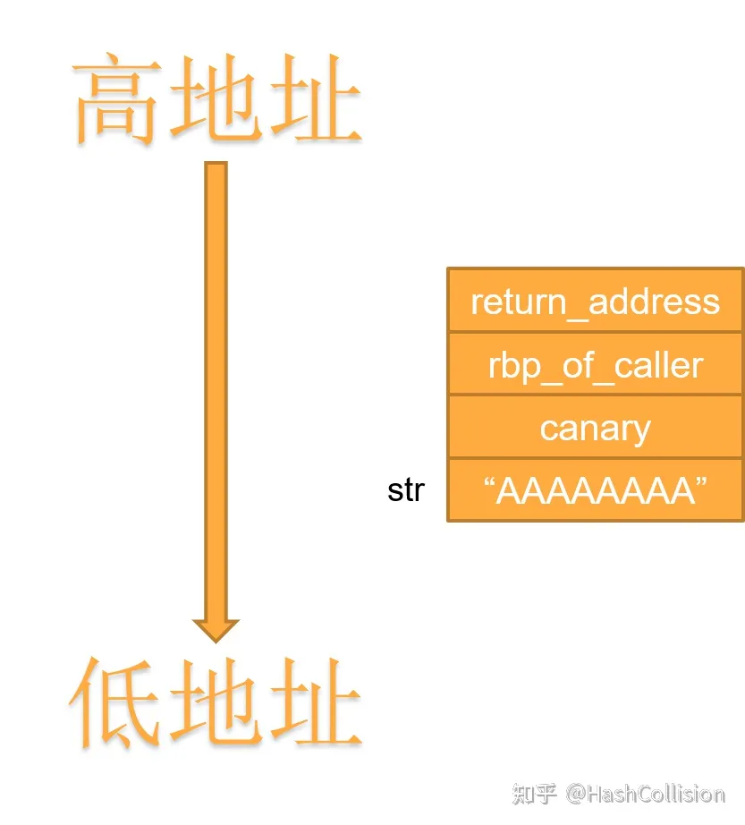

# {{$frontmatter.title}}
[[toc]]

## 作用
- 使程序崩溃
- 查看栈内容 （绕过栈保护）
- **任意地址读写**

任意读
printf("%3$d", 1,2,3);
printf("%s %s %s")
当不给参数时，会尝试读取栈上的数据

任意写
int count = 0;
printf("%n", &count);
%n      一次性写入4个字节
%hn     2个字节
%hhn    一个字节

## 绕过Canary保护
> 原理使用print读取canary的值，并重新放回去
> 或者爆破

确定canary位置
在ida反编译后 xor jz call 的位置就是比较canary的值

这是栈空间布局

