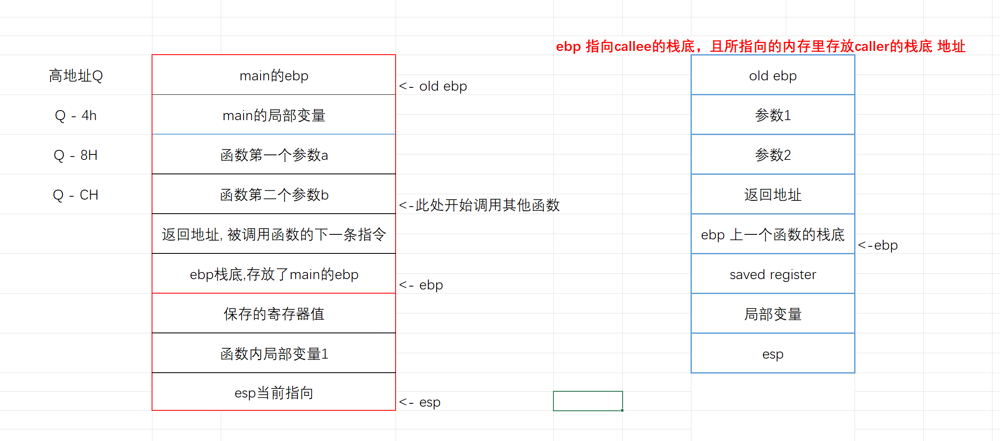

# {{$frontmatter.title}}
[[toc]]

## 汇编层面，函数调用
> 是函数调用者和被调用的函数体之间关于参数传递、返回值传递、堆栈清除、寄存器使用的一种约定。

常见的有
- __cdecl 32 bit
- __stdcall 32 bit
- System V AMD64
- fastcall

### __cdecl C 默认 32 bit
- 从右向左入栈
- 调用者清理堆栈
- 函数参数个数不固定
- 函数名前加下划线

###  __stdcall WIN32 默认 32 bit
- 从右向左入栈
- 函数自身清理堆栈
- 函数名前加下划线，后跟@和大小

### fastcall

## 函数调用栈帧
ebp (extended base pointer) 帧指针

esp (extended stack pointer) 栈指针 永远指向栈帧的顶部

> 这是一个完整的栈帧 main函数调用其他函数

> 64 位调用 前几个参数存放在寄存器中
## 参数传递

### x86
- 通过栈传参数
- 从右向左

### x64
- rdi rsi rdx rcx r8 r9
- 其余参数通过栈也是 从右向左

> 参考： https://blog.csdn.net/wxh0000mm/article/details/97373595